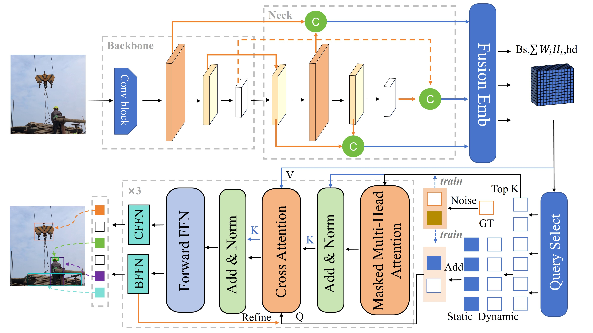

# Automated Detection of Complex Construction Scenes Using a Lightweight Transformer-based Method
This is the implementation of the paper "Automated Detection of Complex Construction Scenes Using a Lightweight Transformer-based Method"

<figure style="text-align: center;">
  
  <figcaption>Overall view of the Complex Construction Scenes Transformer (CSS-TR)</figcaption>
</figure>


# Installation
This code is based on [ultralytics](https://github.com/ultralytics/ultralytics). Please install the required dependencies, and you can also refer to their preparation tutorials as a reference.

## Modules
Relevant improved modules implementation are in `./modules.py`.


## Data prepation
Some data prepation scripts can be found in `utils/data_process`
The data we used are SODA and VisDrone2019 datasets (public datasets), which can also be acquired from this [google_drive](./)


## Train
```
pip install -r requirements.txt
python train.py
```

## Val
```
python val.py
```

## Note
ALL relevent source will be released after acceptance.  
If you have any questions, please feel free to contact me at 'hongru_xiao@tongji.edu.cn'.
